# h1 Sniff

## Rauta & HostOS

- Asus X570 ROG Crosshair VIII Dark Hero AM4
- AMD Ryzen 5800X3D
- G.Skill DDR4 2x16gb 3200MHz CL16
- 2x SK hynix Platinum P41 2TB PCIe NVMe Gen4
- Sapphire Radeon RX 7900 XT NITRO+ Vapor-X
- Windows 11 Home 24H2

**Tehtävän aloitusaika 29.3.2025 kello 19:00.**

## x) Lue ja tiivistä

### Wireshark - Getting Started

### Network Interface Names on Linux

## a) Linux
Debian 12 asennettu virtuaalikoneeseen. Lisäksi päivitetty kaikki ohjelmat, otettu käyttöön palomuuri ja asennettu Virtualbox Guest Additions. Ei ongelmia asennuksessa.

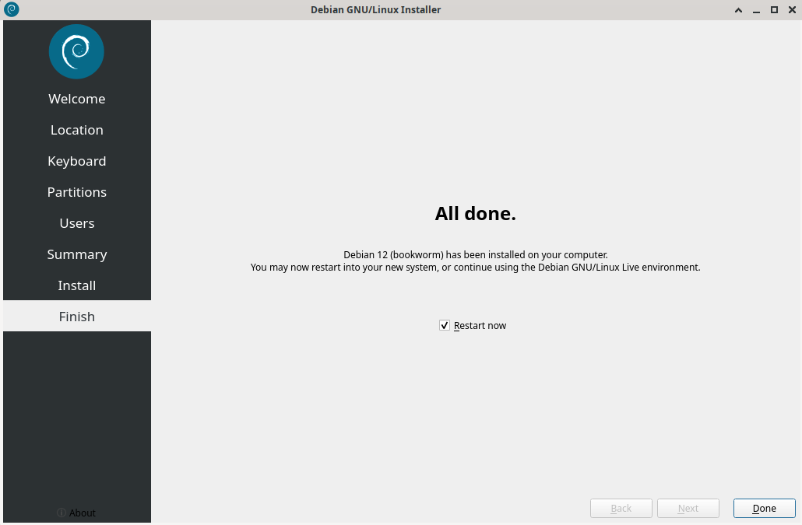

## b) Ei voi kalastaa
Selvittelin tätä varten ensin käytössä olevan ethernet kortin nimi, jotta saadaan se suljettua. Tämä tapahtuu ottamalla esiin listaus käytössä olevista korteista komennolla **ip a**

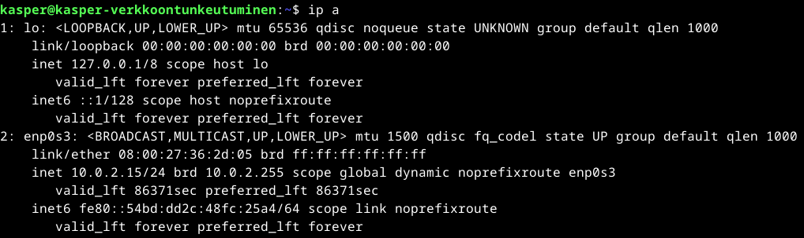

Testasin vielä esimerkiksi, että pingaus toimivaan osoitteeseen **8.8.8.8** toimii, ennen yhteyden sulkemista.

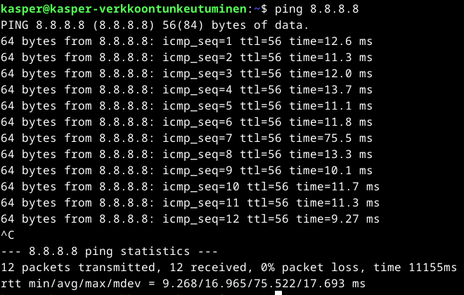

Seuraavaksi suljin koko valitun käytössä olevan interfacen ja siitä saatiin heti ilmoitus yhteyden katkeamisesta.

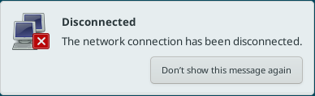

Seuraavaksi testasin, toimiiko pingaus toimivaan osoitteeseen **8.8.8.8**

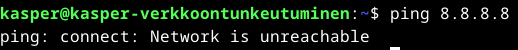

Kuten näkyy, niin ei toiminut. Nostaessa yhteys takaisin ylös saadaan jälleen homma pelittämään.

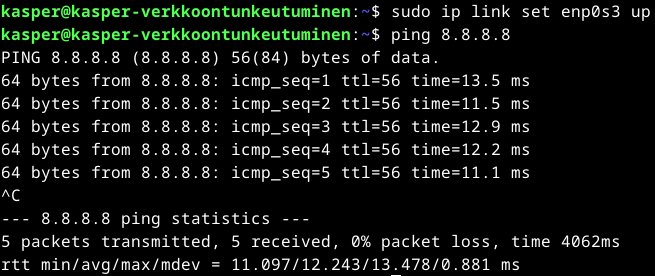

## c) Wireshark
Wireshark asentaminen käytiin hakemalla paketti.

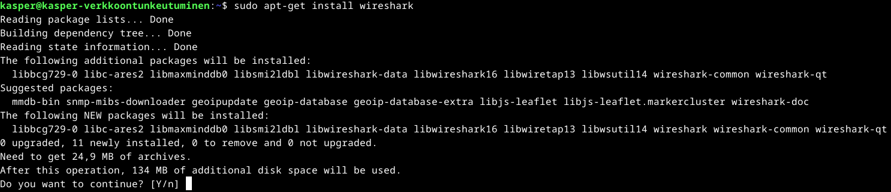

Asentaessa kysytään, saako muutkin kuin superkäyttäjät siepata paketteja ja valitsin tähän Karvisen Teron ohjeistuksen mukaan kyllä.

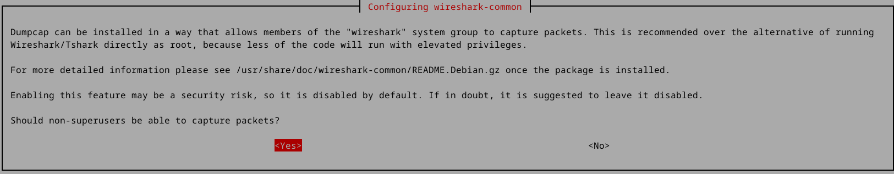

Lisäilin oman käyttäjäni ryhmään nimeltä wireshark käyttöä varten

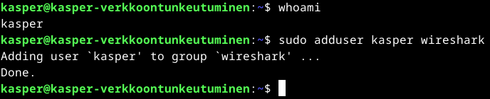

Käynnistelin Wiresharkin toimimaan moitteitta.

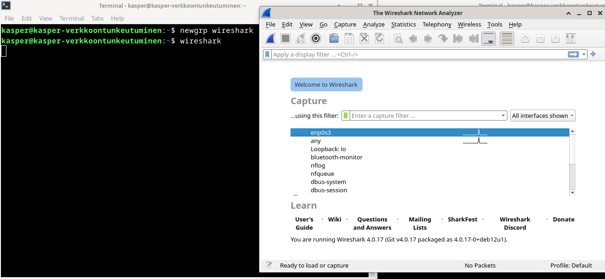

Valitsin oman interfaceni, mikä selvitettiin aikasemmassa kohdassa nimeksi **enp0s3** ja aloitin paketien kaappaamisen. Pingasin jälleen kohdetta **8.8.8.8** niin saatiin jotain kaapattuakin.

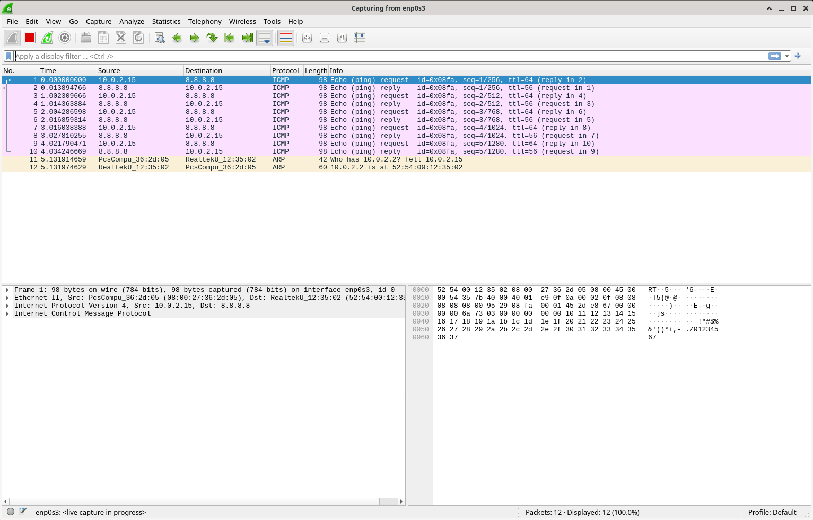

## d) Oikeesti TCP/IP
TCP/IP mallihan rakentuu neljästä kerrokseta. **Application layer**, **Transport layer**, **Internet layer** sekä **Link layer**. Tehtävää varten kaappasin uudelleen omaa liikennettäni **enp0s3** ja kävin terminaaliin syöttämmässä **curl www.google.com**. 

### Application layer
Hypertext Transfer Protocol, eli HTTP näyttää host osoitteen olevan avattu www.google.com ja näyttää esimerkiksi source sekä destination valitut portit.

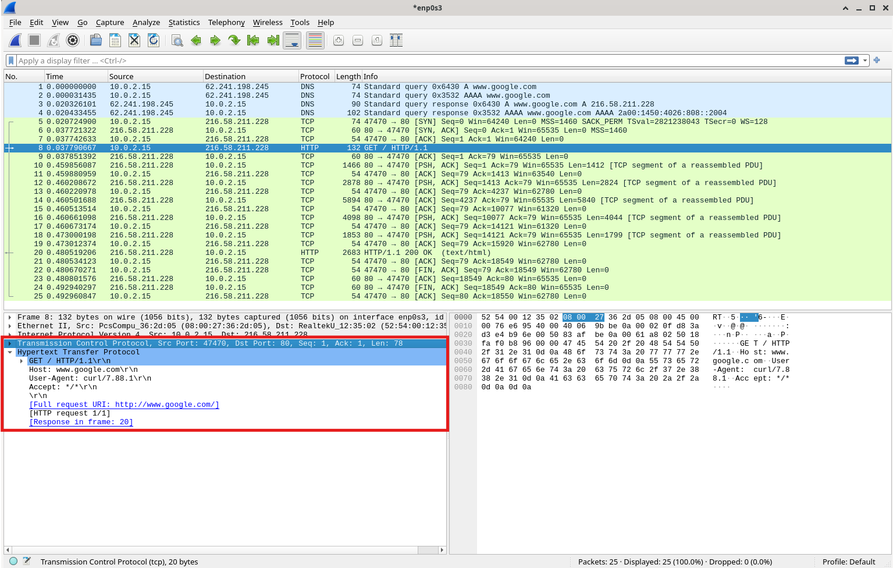

### Transport layer
Transmission Control Protocol. Näyttää esimerkiksi source ja destination portit.

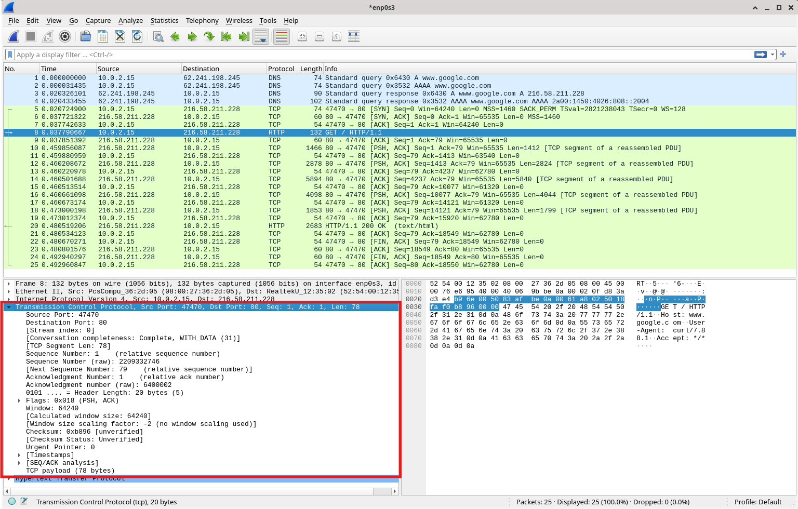

### Internet layer
Internet Protocol Version 4. IPV4. Näyttää käytössä olevan IPV4 osoitteet molempiin suuntiin.

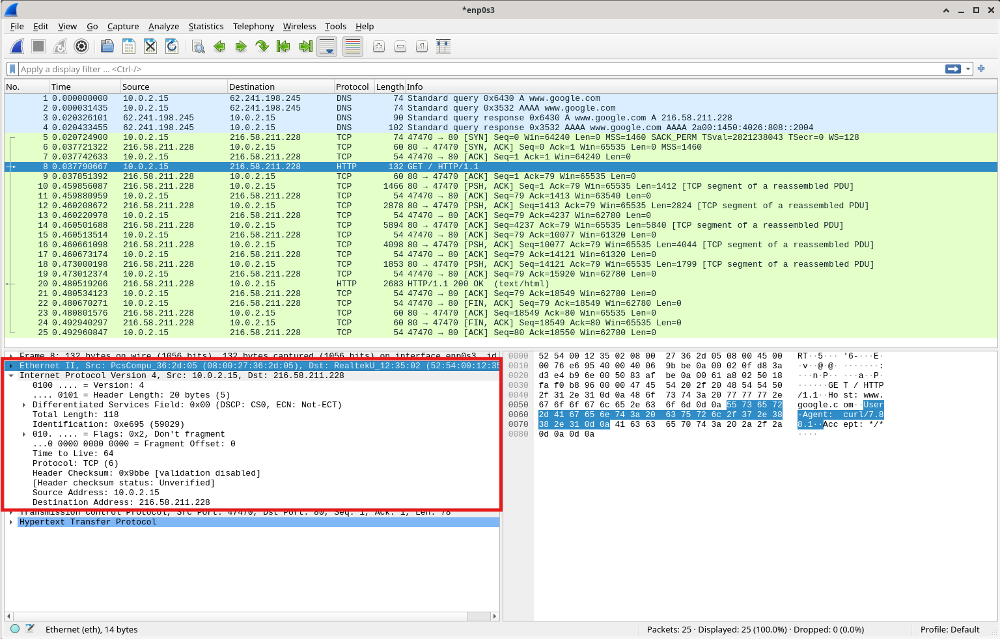

### Link layer
Ethernet II. Näyttää MAC-osoitteet. Kuvasta voidaan esimerkiksi päätellä käytössäni oleva Realtekin valmistama verkkokortti.

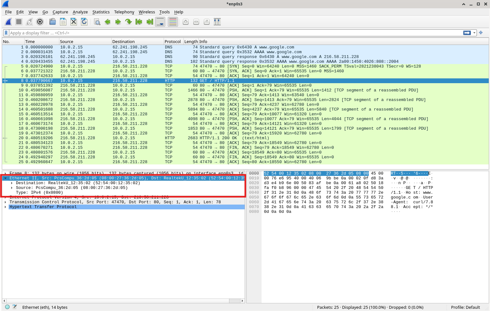

## e) Mitäs tuli surffattua?

## f) Mitä selainta käyttäjä käyttää?

## g) Minkä merkkinen verkkokortti käyttäjällä on?

## h) Millä weppipalvelimella käyttäjä on surffaillut?

## i) Analyysi

**Tehtävän lopetusaika 29.3.2025 kello XXXX. Aktiivista työskentelyä yhteensä noin X tuntia.**

## Lähteet

