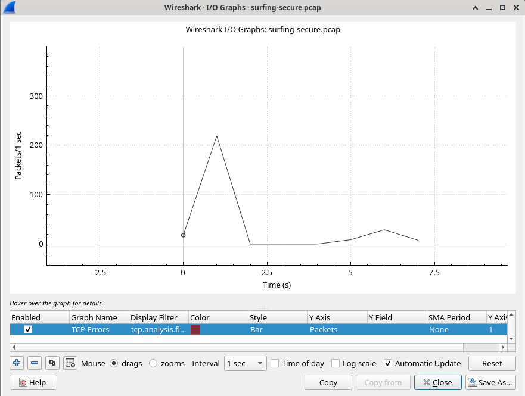

# h1 Sniff

## Rauta & HostOS

- Asus X570 ROG Crosshair VIII Dark Hero AM4
- AMD Ryzen 5800X3D
- G.Skill DDR4 2x16gb 3200MHz CL16
- 2x SK hynix Platinum P41 2TB PCIe NVMe Gen4
- Sapphire Radeon RX 7900 XT NITRO+ Vapor-X
- Windows 11 Home 24H2

**Tehtävän aloitusaika 29.3.2025 kello 19:00.**

## x) Lue ja tiivistä

### Wireshark - Getting Started
- Wireshark on johtava verkkoliikenteen sieppaaja ja analysoija. Artikkelissa käsitellään Wiresharkin käyttöönottoa ja ensiaskelia tarkemmin.
- Ohjeissa asennetaan Wireshark Debian pohjaiselle Linuxille ja ohjeistetaan esimerkiksi valitsemaan oikea (oma) verkkolaite, sekä kaappaamaan omaa liikennettä.
- Lisäksi ohjeistuksessa opetetaan tallentamaan ja avaamaan kaapattua liikennettä.
- Statistiikka, kuten Endpointit, I/O Graphit ja Protocal hierarchy käyttö sekä erilaisten filttereiden, kuten dns, tls, http, tcp ja ip käyttöä avataan artikkelissa pintapuolisesti

(Karvinen 2025)

### Network Interface Names on Linux
- Artikkelissa käsitellään Linuxin verkkoliitäntöjä ja niiden nimeämisperjaatteita.
- Linuxissa verkkoliitännät tulee suoraan systemd puolesta.
- Nimeien alussa oleva etuliite kertoo sen tyypin, kuten esimerkiksi **en** on ethernet yhteys, **wl** on langaton wifi/wlan yhteys sekä **lo** on loopback.
- Artikkelissa kerrotaan myös millä tavalla ne voi CLI kautta selvittää. **ip a ja ip route ** kertoo tarvittavat tiedot verkkoliitännöistä

(Karvinen 2025)

## a) Linux
Debian 12 asennettu virtuaalikoneeseen. Lisäksi päivitetty kaikki ohjelmat, otettu käyttöön palomuuri ja asennettu Virtualbox Guest Additions. Ei ongelmia asennuksessa.

## b) Ei voi kalastaa
Selvittelin tätä varten ensin käytössä olevan ethernet kortin nimi, jotta saadaan se suljettua. Tämä tapahtuu ottamalla esiin listaus käytössä olevista korteista komennolla **ip a**

Testasin vielä esimerkiksi, että pingaus toimivaan osoitteeseen **8.8.8.8** toimii, ennen yhteyden sulkemista.

Seuraavaksi suljin koko valitun käytössä olevan interfacen ja siitä saatiin heti ilmoitus yhteyden katkeamisesta.

Seuraavaksi testasin, toimiiko pingaus toimivaan osoitteeseen **8.8.8.8**

Kuten näkyy, niin ei toiminut. Nostaessa yhteys takaisin ylös saadaan jälleen homma pelittämään.

(Karvinen 2025; Red Hat Enterprise)

## c) Wireshark
Wireshark asentaminen käytiin hakemalla paketti.

Asentaessa kysytään, saako muutkin kuin superkäyttäjät siepata paketteja ja valitsin tähän Karvisen Teron ohjeistuksen mukaan kyllä.

Lisäilin oman käyttäjäni ryhmään nimeltä wireshark käyttöä varten

Käynnistelin Wiresharkin toimimaan moitteitta.

Valitsin oman interfaceni, mikä selvitettiin aikasemmassa kohdassa nimeksi **enp0s3** ja aloitin paketien kaappaamisen. Pingasin jälleen kohdetta **8.8.8.8** niin saatiin jotain kaapattuakin.

(Karvinen 2025)

## d) Oikeesti TCP/IP
TCP/IP mallihan rakentuu neljästä kerrokseta. **Application layer**, **Transport layer**, **Internet layer** sekä **Link layer**. Tehtävää varten kaappasin uudelleen omaa liikennettäni **enp0s3** ja kävin terminaaliin syöttämmässä **curl www.google.com**. 

### Application layer
Hypertext Transfer Protocol, eli HTTP näyttää host osoitteen olevan avattu www.google.com ja näyttää esimerkiksi source sekä destination valitut portit.

### Transport layer
Transmission Control Protocol. Näyttää esimerkiksi source ja destination portit.

### Internet layer
Internet Protocol Version 4. IPV4. Näyttää käytössä olevan IPV4 osoitteet molempiin suuntiin.

### Link layer
Ethernet II. Näyttää MAC-osoitteet. Kuvasta voidaan esimerkiksi päätellä käytössäni oleva Realtekin valmistama verkkokortti.

(Wikipedia Internet Protocol Suite 2025)

## e) Mitäs tuli surffattua?
Tehtävää varten tuli ladata surfing-secure.pcap tiedosto, mutta piti vielä väliin latailla wget millä saada se ladattua. 

Wiresharkissa avaaminen tapahtui valitsemalla file valikosta open ja sieltä tiedosto avaukseen.

Saadaan näkyviin laaja kattaus kaappausta. Ensin pisti silmään esimerkiksi se, että paketteja oli kokonaisuudessan **283**. Lisäksi mielestäni käyttäjä toimii IPv4 osoitteella 192.168.122.7.

Tarkastelemalla tarkemmin Protocal Hierarchy Statistics valikkoa, nähdään tarkempaa jakaumaa pakettien tyypistä.

Endpointseja tarkastelemalla nähdään, että Ethernet yhteyksiä on 2 kappaletta ja IPv4 osoitteita 7 kappaletta.

I/O Graphsista saadaan selville myös se, että pakettien sieppaus kesti noin 7 sekunttia.

(Karvinen 2025)

## f) Mitä selainta käyttäjä käyttää?
Tätä yritin etsiä, mutta en löytänyt millään joten jäi tyhjä arpa käteen tämän kohdan osalta.

## g) Minkä merkkinen verkkokortti käyttäjällä on?
Verkkokorttin malli saadaan näkyviin, kun etsitään käyttäjän toiminnoista siihen sopiva layeri ja löydetään, että kyseessä on Realtek valmistajan verkkokortti.

## h) Millä weppipalvelimella käyttäjä on surffaillut?
Kun aletaan tarkastelemaan, millä weppipalvelimella käyttäjä on surfaillut niin etsin DNS eli nimipalveluun liittyviä paketteja. Esimerkiksi paketti numero 19 on nimikysely **terokarvinen.com** ja hieman alempaa paketti 21 löytyy myös **gc.zgo.at**. Myöhemmin löytyy vastauksia kysynnälle osoitteesta **goatcounter.netlify.com**. Tämän alla näitä kahta on yhdisteltynä muodossa **terokarvinen.goatcounter.com**. Tässä varmaan haettu weppipalvelin? Muuta en keksinyt.

**Tauko tehtävien tekemisessä alkaen 29.3.2025 kello 21:45**

## i) Analyysi

**Tehtävien tekeminen jatkuu 30.3.2025 kello 14:30**

Analyysi osuutta varten tein laitoin kaappauksen päälle ja pingasin osoitetta www.google.com yhden kerran (Komennolla **ping -c 1 www.google.com**, jotta pakettien määrä pysyi kohtuullisena. Wireshark kaappaukseen sisältyi kokonaisuudessaan 8 pakettia ja kaikki liittyy suoritettuun pingaukseen. Kokonaisuus koostuu pääsiassa DNS protokollista.

- **Paketti 1:** Kaappaus alkaa DNS kyselyllä osoitteesta 10.0.2.15 osoitteeseen 62.241.198.245, missä pyydetään www.google.com IPv4 osoitetta. Tämä me tiedetään, koska kyseessä on A query.
- **Paketti 2:** Toinen paketti jatkaa DNS kyselyä osoitteesta 10.0.2.15 osoitteeseen 62.241.198.245, mutta tässä pyydetään puolestaan www.google.com IPv6 osoitetta. Kyseessä on AAAA query.
- **Paketti 3:** Kolmannessa paketissa DNS kysely saa vastauksena pyydetyn IPv4 osoitteen A queryssä 216.58.211.228
- **Paketti 4:** Neljäs paketti puolestaan sisältää DNS kyselyn vastauksen IPv6 osoitteen AAAA queryssä 2a00:1450:4026:808:2004
- **Paketti 5 & 6:** Nämä oli itselle hieman mysteeri, mutta pienen selvittelyn jälkeen nämä ovat ping komentoon liittyvät sekvenssimuero sekä time to live arvo. Tyypillisiä tietenkin ping yhteyden lomassa, mitkä näkyy esimerkiksi myös terminaalissa kun suorittaa pingausta. Käytännössä siis annettu sekvenssinumero (tässä tapauksessa ensimmäinen ja ainoa pingaus) sekä paketin elinaika.
- **Paketti 7 & 8:** Näissä paketeissa on kyseessä Reverse DNS prosessista, mikä tapahtuu DNS tapahtumien yhteydessä. Käytännössä prosessissa nykytään DNS-palvelimelta hostnamea, joka on yhteydessä alkuperäiseen IP-osoitteeseen.

(Infoblox 2017; NetApp 2022, Wikipedia Reverse DNS lookup 2025)

**Tehtävän lopetusaika 30.3.2025 kello 15:30. Aktiivista työskentelyä yhteensä noin 3 tuntia 45 minuuttia.**

## Lähteet
Karvinen T 2025. h1 Sniff. Tero Karvisen verkkosivut. Luettavissa: https://terokarvinen.com/verkkoon-tunkeutuminen-ja-tiedustelu/ Luettu 29.03.2025

Karvinen T 2025. Wireshark - Getting Started. Tero Karvisen verkkosivut. Luettavissa: https://terokarvinen.com/wireshark-getting-started/ Luettu 29.03.2025

Karvinen T 2025. Network Interface Names on Linux. Tero Karvisen verkkosivut. Luettavissa: https://terokarvinen.com/network-interface-linux/ Luettu 29.03.2025

Red Hat Enterprise Linux. ip Command Cheat Sheet. Redhat verkkosivut. Luettavissa: https://access.redhat.com/sites/default/files/attachments/rh_ip_command_cheatsheet_1214_jcs_print.pdf Luettu 29.03.2025

Wikipedia 2025. Internet Protocol Suite. Wikipedia.com. Luettavissa: https://en.wikipedia.org/wiki/Internet_protocol_suite Luettu 29.03.2025

Infoblox 2017. Why should we separate A and AAAA DNS Queries. Infoblox verkkosivut. Luettavissa: https://blogs.infoblox.com/ipv6-coe/why-should-we-separate-a-and-aaaa-dns-queries/ Luettu 30.03.2025

NetApp 2022. What are ICMP PING responses. Netapp verkkosivut. Luettavissa: https://docs.netapp.com/us-en/e-series-santricity-116/sm-hardware/what-are-icmp-ping-responses.html Luettu 30.03.2025

Wikipedia 2025. Reverse DNS lookup. Wikipedia.com. Luettavissa: https://en.wikipedia.org/wiki/Reverse_DNS_lookup Luettu 30.03.2025
