# h2 Tehtävänannot

## Rauta & HostOS

- Asus X570 ROG Crosshair VIII Dark Hero AM4
- AMD Ryzen 5800X3D
- G.Skill DDR4 2x16gb 3200MHz CL16
- 2x SK hynix Platinum P41 2TB PCIe NVMe Gen4
- Sapphire Radeon RX 7900 XT NITRO+ Vapor-X
- Windows 11 Home 24H2

**Tehtävän aloitusaika 6.4.2025 kello 17:00**

## x) Lue/katso/kuuntele ja tiivistä

### Selitä tuskan pyramidin idea
- Tuskan pyramiidi kuvaa sitä, kuinka hyökkääjän tiedon tunnistamisen arvo vs aiheutuva vaiva kohtaavat, eli käytännössä kuinka paljon työtä vaaditaan hyökkääjältä hyökkäyksen muokkaamiseen.
- Tuskan pyramiidissa on seitsemän eri kohtaa. Helpoin on hash values pyramiidin alin, välistä löytyy IP addresses, domain names, network/host artifacts, tools ja ylimpänä ns. vaikein eli TTP's (Tactics, Techniques and Procedures)

(Bianco 2013)
### Selitä timanttimallin (Diamond Model) idea
- Timanttimalli on neljästä toisiinsa liittyvstä ydinteemsta muodostuva tunkeutumisen analysoinnin kehys
- Neljä ydinteemaa ovat: Adversary, Capability, Infrastructure ja Victim

(Caltagirone 2013)
## a) Apache log
Tehtävän suorittamista varten oli alkuun oleellista asentaa ja käynnistää Apache2 demoni.

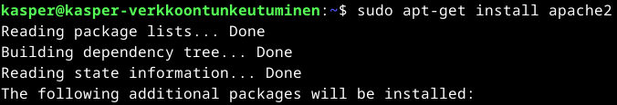
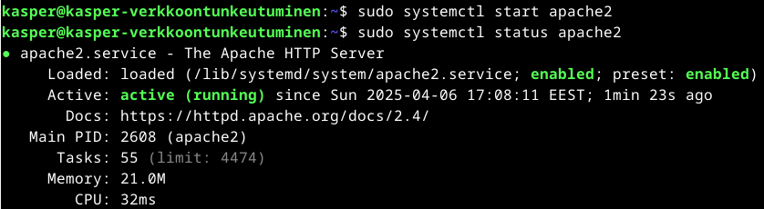
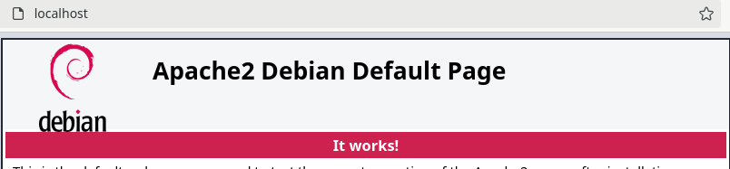

Aktiivisten lokitietojen tarkastelua varten suoritin komennon **sudo tail -F /var/log/apache2/access.log** ja refreshasin localhost osoitteen selaimessa.

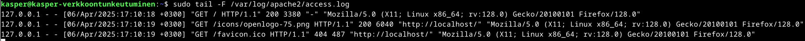

Tarkastellaan ylimmäistä lokitietoa tarkemmin.
- **127.0.0.1**: Tämä on IP-osoitteeni, tässä tapauksessa localhost osoitteeni sillä pyyntö on tullut samalla koneelta missä palvelin (Apache2) toimii.
- **Päivämäärä ja aika**: Kuvaa luonnollisesti tapahtuman aikaa.
- **GET / HTTP/1.1**: Kysessä on GET-pyyntö, millä pyydettiin palvelimella tietoja. HTTP 1.1 on protokolla, mitä käytettiin.
- **200**: HTTP-statuskoodi, 200 tarkoittaa OK, eli pyyntö onnistui.
- **3388**: Bytes Sent. Palvelimen lähettämän vastauksen tavujen kokonaismäärä.
- **-**: Referer kenttä, eli näyttää sivun URL, jola käyttäjä tuli pyydetylle sivulle. Tässä tapauksessa - tarkoittaa, että käyttäjä ei lähettänyt Referer otsikkoa vaan kirjoitti URL esimerkiksi suoraan selaimeen kuten tein.
- **Mozilla/5.0 (X11; Linux x86_64; rv:128.0) Gecko/20100101 Firefox/128.0** User Agent. Tunnistaa mistä ohjelmistosta, eli selaimesta tässä tapauksessa pyyntö on tullut.

(Karvinen 2025; Dancuk 2024)
## b) Nmapped
Tehtävää varten asentelin alkuun nmapin.

Ettei vahingossakaan skannata muita kuin omia portteja, suljin varmuudeksi verkkoyhteyteni. Testiksi pingaus 8.8.8.8, että meni varmasti kiinni.

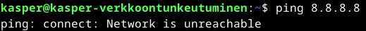

Tarkoitus oli porttiskannata omaa localhostia. Tein sen tässä tapauskessa komennolla **sudo nmap -T4 -A localhosts**. Analysoidaan vielä syötettyä tekstiä tarkemmin:

- **nmap**: nmap valintakomento / ohjelman nimi, että saadaan edes ohjelma käyttöön.
- **-T4**: -T0-5 valinnalla saadaan määritettyä kuinka porttiskannaus ajoitetaan. -T0 ollen hitain vaihtoehto ja -T5 nopein. Tässä skannauksessa käytetty -T4 vaihtoehto on manuaalin mukaan luokkaa "Aggressive scan".
- **-A**: on version detection valinta. Lisäämällä -A syötteeseen, porttiskannaus toimittaa esimerkiksi OS detection, version detection, script scanning ja traceroute lisäykset skannaukseen.
- **localhost**: Toimittaa kohteen virkaa. Tähän voisi vaihtaa minkä tahansa IP osoitteen mitä skannataan, mutta koska kohteena on oma tietokone voidaan käyttää luonnollisesti myös localhost vaihtoehtoa.

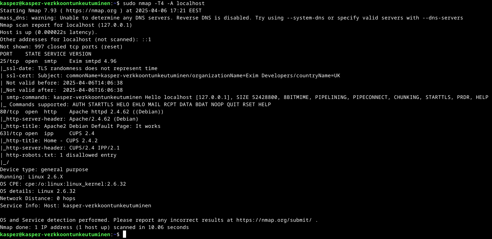

Tuloksia voidaan analysoida hieman tarkemmin, mutta etenkin 80/TCP oli pyydetty analysoitavaksi tehtävän puolesta:

- **Starting Nmap 7.93**: Nmap käynnistyy ja lisäksi kerrottu versionumero sekä ajankohta
- **Nmap scan report for localhost**: Kohdeosoite
- **Host is up**: Vahvistus siitä, että kohde on tavoitettavissa
- **Not shown**: 997 suljettua tcp porttia ei näytetty
- **80/tcp open**: Portista 80 löytyy puolestaan käynnistelty Apache2 ja siihen liittyvät http-server-header/title postaukset
- **Network Distances**: 0 hops, koska tapauskessa skannataan omaa verkkoa.
- **OS and Service detection performed**: Tämä on vain muistutus siitä, että OS and Service detection suoritettiin.
- **Nmap done**: Lopuksi vielä raportti siitä, kuinka monta IP-osoitetta skannattiin ja kuinka kauan skannauksessa kesti. Tässä tapauksessa yksi osoite ja 10.06 sekunttia.

(Karvinen 2025; Nurminen 2025)
## c) Skriptit
Kuten jo aikaisemmassa tehtävässä purin hieman -A komennon ajatusta, mutta lisäämällä -A syötteeseen saadaan käyttöön seuraavat elementit: **OS detection, version detection, script scanning ja traceroute**

Tehtävänannon kysymyksen asettelu oli itselle hieman haastava, mutta tässä kuitenkin ilmeisesti haettiin myös 80/TCP portin syötteen skriptejä?
- **http-server-header**: "Apache/2.4.62 (Debian)", paljastaa siis palvelimet ohjelmiston sekä version.
- **http-title**: "Apache2 Debian Default Page: It works", paljastaa verkkosivun title-elementin sisällön

(Karvinen 2025, Nurminen 2025)
## d) Jäljet lokissa
Itse lähdin tarkastelemaan Apache2 access.log tiedostoa suoraan **sudo grep -i "nmap" /var/log/apache2/access.log** komennolla.

- **grep** Käynnistelee itse ohjelman
- **-i nmap** -i tekee kirjainkoosta riippumattoman ja nmap etsii "nmap" esiintymiä.
- Loppuun vielä sijainti, eli apache2 access.log

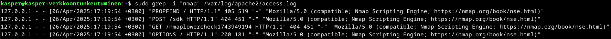

Vastauksia oli aika kattavasti, mutta kuvassa muutama esimerkki mitä löysin. **Nmap** esiintyy näissä "Nmap Scripting Engine" muodossa.

- **127.0.0.1**: Jälleen tämä on IP-osoitteeni, eli localhost missä Apache2 pyörii.
- **Päivämäärä ja aika**: Kuvaa tapahtuman aikaa.
- **PROPFIND / HTTP/1.1**: Kysessä on PROPFIND metodi, mitä käytetään WebDAV protokollassa tiedostojen ja kansioiden ominaisuuksien hakemiseen. HTTP 1.1 on protokolla, mitä käytettiin.
- **405**: HTTP-statuskoodi, 405 tarkoittaa, että metodi ei ole sallittu.
- **519**: Bytes Sent. Palvelimen lähettämän vastauksen tavujen kokonaismäärä.
- **-**: Referer kenttä, eli näyttää sivun URL, jolla käyttäjä tuli pyydetylle sivulle.
- **Mozilla/5.0 (compatible; Nmap Scripting Engine; https://nmap.org/book/nse.html** User Agent. Tunnistaa mistä ohjelmistosta, eli selaimesta tässä tapauksessa pyyntö on tullut ja tästä nähdäänkin että pyynnön on tehnyt porttiskannatessa Nmap.

(Karvinen 2025; QuickRef; Wikipedia)
## e) Wire sharking
Wireshark käyntiin ja Loopback:lo valinnaksi, sillä se vastaa omaa Localhostia mitä skannataan pian. 

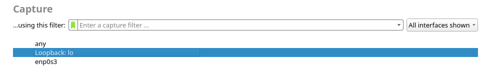

Sieppaus käynnissä ja porttiskannaus samalla methodilla kuin aikaisemmin, eli **sudo nmap -T4 -A localhosts**. Paketteja kertyi Wiresharkiin kokonaisuudessaan 2985 kappaletta. Seuraavaksi tallensin pcap tiedoston.

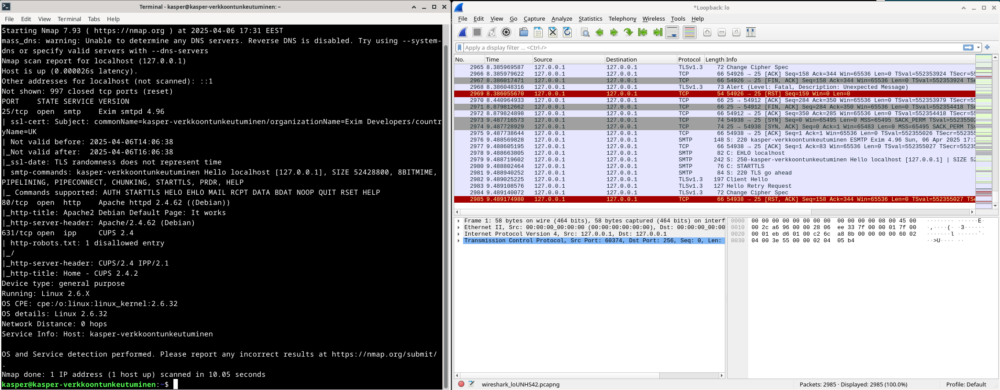
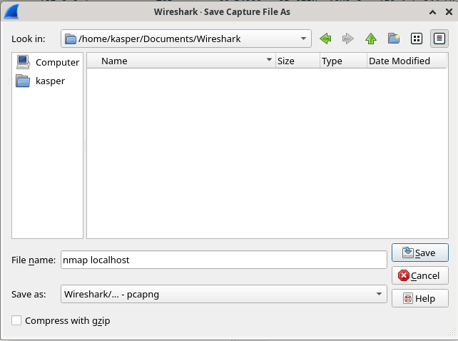

Tarkoitus oli tarkastella tarkemmin niitä paketteja, mistä filtteröimällä löytyy yhteensä 54 kappaletta paketteja mitkä sisältää "**nmap**". Nämähän pystyi filtteröimään lisäämällä kenttään **frame contains "nmap"**.

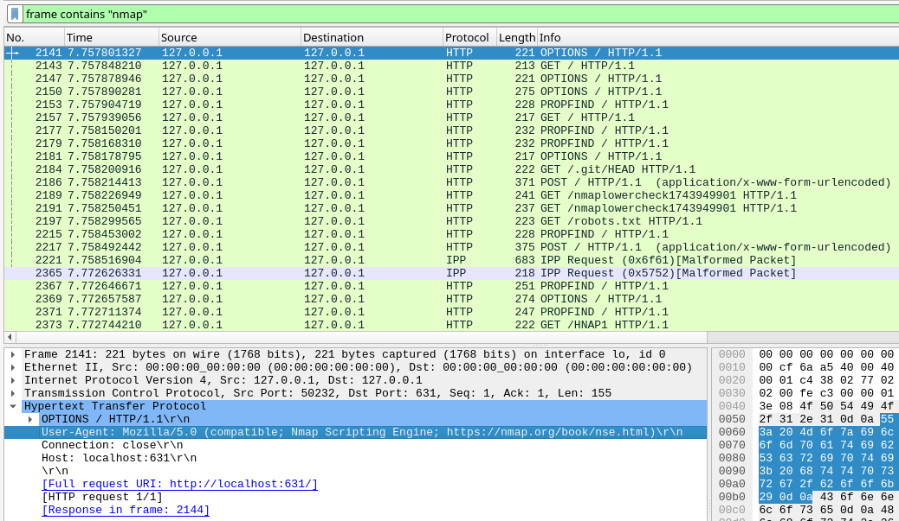

Paketit koostuu erilaisista HTTP protokollan GET, POST, OPTIONS, PROPFIND ja muutamasta IPP Request paketista. Teema on pääsääntöisesti sama, filtteröity nmap löytyy eri muodoissa Application Layeriltä. Pääsääntöisesti kaikki tarkastelemani sisältävät kohdan **"Nmap Scripting Engine"**.

(Karvinen 2025)
## f) Net grep
Tehtävää varten oli tarvetta asennella ngrep, joka löytyi suoraan Debianin repositorystä.

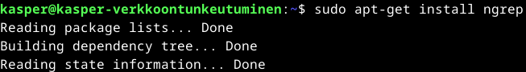

Tarkoituksena oli siepata verkkoliikennettä ngrepillä, lähdin suorittamaan ngrep käynnistystä komennolla **sudo ngrep -d lo -i nmap**

- **Ngrep** Käynnistelee itse ohjelman
- **-d lo** Määrittelee kuunneltavan kohteen, tässä tapauksessa localhost eli lo
- **-i nmap** -i tekee kirjainkoosta riippumattoman ja nmap etsii "nmap" esiintymiä.

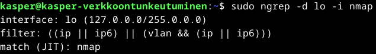

Porttiskannaus pyörimään ja tuloksia alkoi satelemaan. Yhteensä paketteja kertyi 3045, joista 54 kappaletta vastasi syötteeseen nmap.

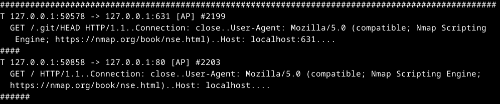
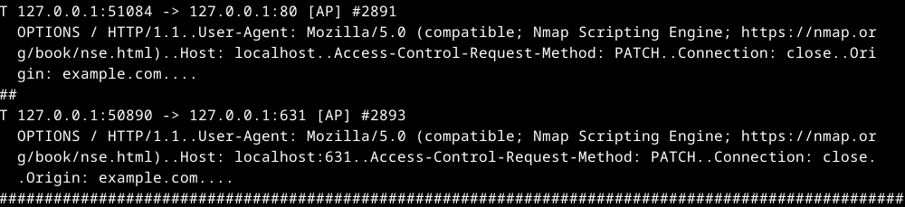

Mielestäni tulokset vastaavat esimerkiksi Wiresharkin tuloksia kattavuudeltaan, itse en päällisin puolin huomaa mitään poikkeavaa mitä en Wiresharkista tai Apache2 logeista löytäisi. Analysoidaan hieman kummiskin:

- **T**: Kyseessä on TCP paketti.
- **127.0.0.1:50578 - > 127.0.0.1:631**: Paikallisen koneen ja nmap välinen liikenne.
- **[AP]**: Tälle en löytänyt varsinaista vahvistusta, mutta ilmeisesti kyseessä on A = ACK-lippu ja P = PUSH-lippu?
- **#2199**: Siepatun paketin numero.
- **GET /.git/HEAD HTTP / 1.1**: GET-pyyntö, pyydetty polku sekä HTTP protokollan versio
- **Connection : close**: HTTP kertoo palvelimelle, että yhteys tulee sulkea
- **User - Agent : Mozilla / 5.0 ( compatible ; Nmap Scripting Engine ; https://nmap.org/book/nse.html )**: Pyynnön tekijä
- **Host : localhost : 631**: Pyynnön kohde ja portti, eli localhost.

(Karvinen 2025; Haiqus 2021)
## g) Agentti & h) Pienemmät jäljet
Skriptejä hyödyntäen pystytään muuttamaan porttiskannatessa agenttia niin, että saadaan nmap näyttämään muulta kuin mitä se todellisuudessa on. Tarkastelin alkuun hieman, millaisia skriptejä on nmapille olemassa komennolla **dpkg --listfiles nmap-common**

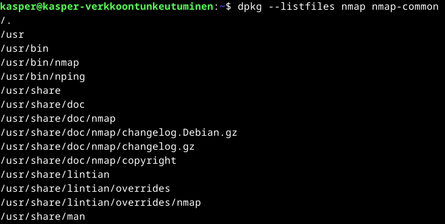
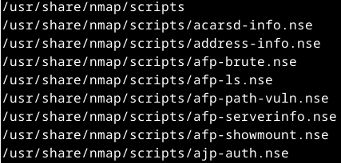

Tiedostoja, missä nmap on nimettynä löytyy hurja määrä, mutta joukossa oli myös skriptejä. Tarkastellaan tarkemmin, mitä skriptejä on tarjolla. **dpkg --listfiles nmap-common |grep http-title**.

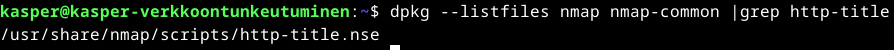
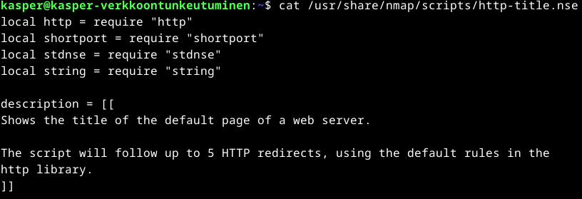

**http-title.nse** skripti näyttää redirektaavan 5 kappaletta http osotteita? Ihan tarkkaan en ymmärtänyt, mutta tämä ei ole ainakaan tarpeellinen tämän tehtävän kannalta vaan tarkastellaan hieman tarkemmin löytyisikö jotain agent liittyvää komennolla **dpkg --listfiles nmap-common |grep agent**.

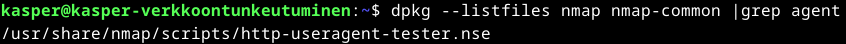
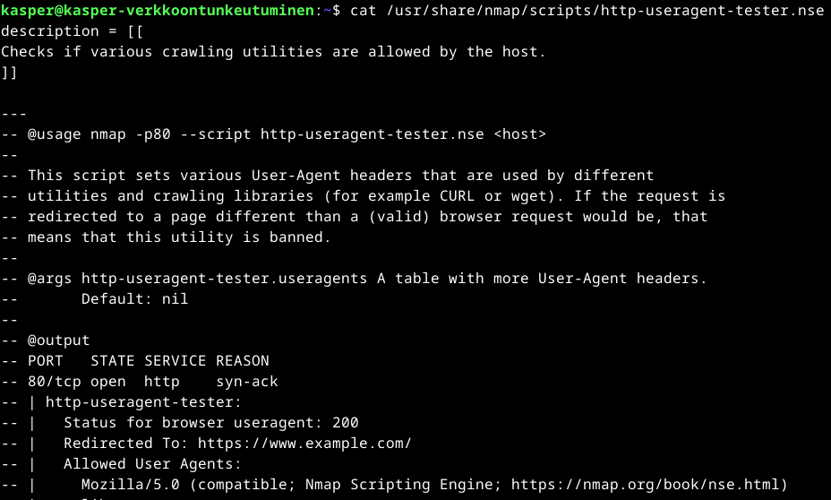

**http-useragent-tester.nse** skripti näyttää hyödyntävän User-Agent headereita niin, että voidaan itse asettaa skriptin avulla sopiva agentti piilottamaan nmap hakutuloksista. Tero olikin jo sivuillansa antanut esimerkin käytöstä ja lähdin toteuttamaan sitä lisäämällä scriptin alkuperäiseen nmap porttiskannaus komentooni.

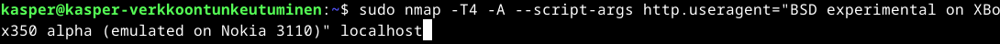

Wireshark tuloksista huomataan, että vaikka paketteja saatiin yhteensä **2998** kappaletta, niistä filtteröimällä enään kahdesta löytyy joku viittaus **nmap**. Kun tarkastellaan esimerkiksi yhden näistä paketeista sisältöä Wiresharkin Application Layerillä, nähdään miten User-Agent on muuttunut meidän antaman syötteen **"BSD experimental on XBox350 alpha (emulated on Nokia 3110)"** muotoon. Ainoa viittaus nmap löytyy tapahtumasta "nmaplowercheck...".

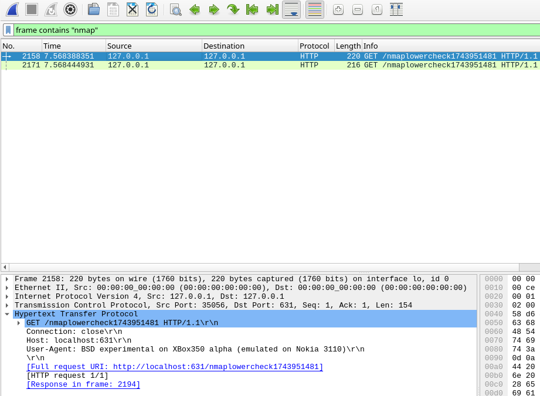

Ja kun käydään tarkastelemassa Apache2 logitietoja, sama teema toistuu myös siellä. Logeista nähdään miten sinne on ilmestynyt enään yksi kappale nmap sisältäviä tietoja.

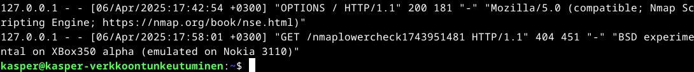

(Karvinen 2025)
## i) Hieman vaikeampi
Lähdin selvittelemään, että miten viimeisimmästä porttiskannauksesta saataisiin vielä kyseinen **"nmaplowercheck"** piilotettua. Tero olikin vinkannut, että tarpeellista on muokata /usr/share/nmap sisältä löytyvää tiedostoa. Googlettamalla yhdsestä [artikkelista](https://infosecwriteups.com/evading-detection-while-using-nmap-69633df091f3) selvisi, että kyseessä on /nselib/http.lua, mitä on tarkoitus lähteä muokkaamaan. Löysin samalla nmap:in GitHub sivustolta kyseisen nmaplowercheck koodin, mikä on "**"The URLs used to check 404s"** toiminto. Grep komennolla löydetään se myös kansiosta löydetystä tiedostosta.

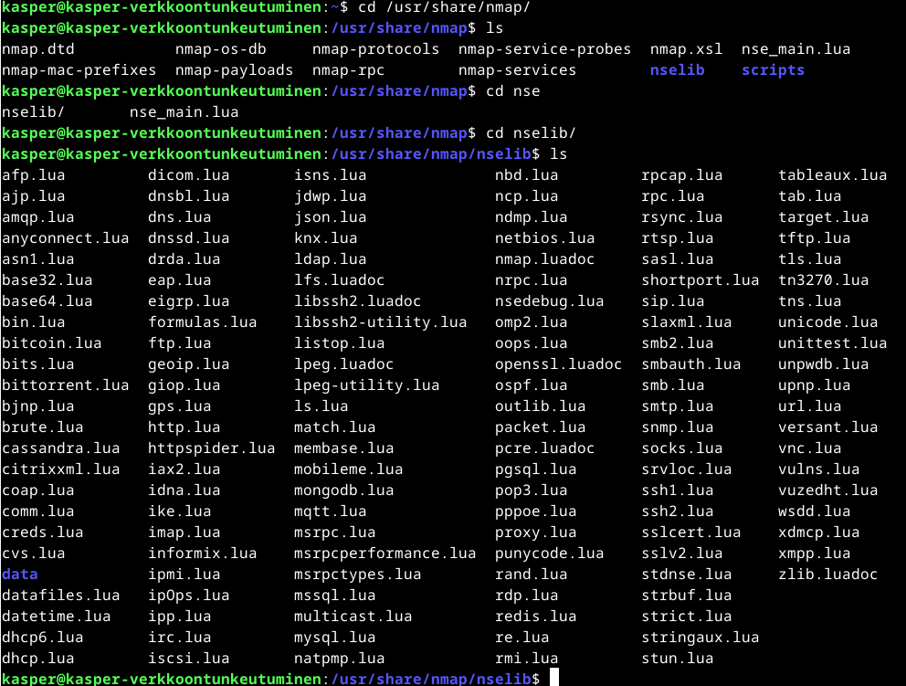
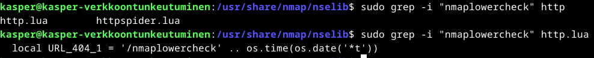

**Sudoedit** komennolla tiedosto auki ja rivi etsintään, mikä löytyikin kuten Grep meille jo tiesi kertoa.

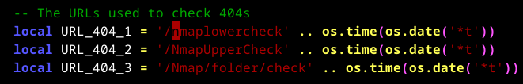

Itse muokkasin **"nmaplowercheck"** tilalle **"testi"** ja tallensin.

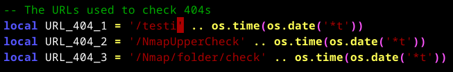

Seuraavaksi lähdin suorittamaan täysin samaa nmap skannausta mitä edellisessä tehtävässä.

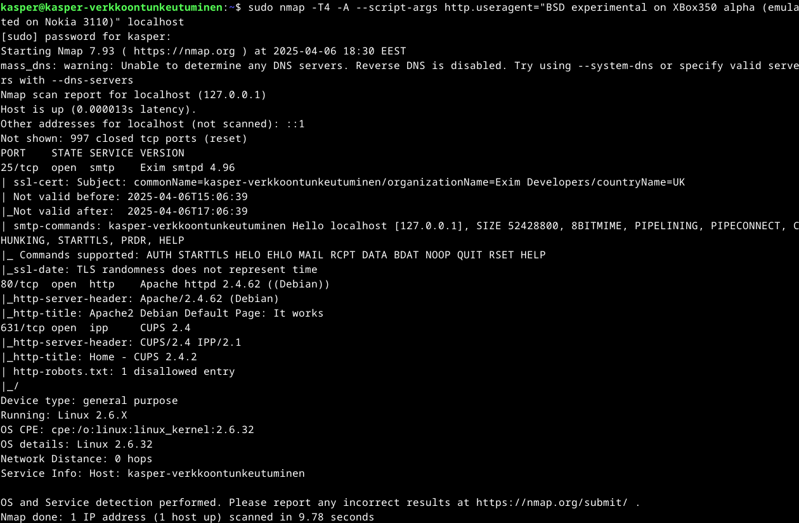

Ja kun tarkastellaan ngrep, wireshark sekä Apache2 logien tietoja. Nähdään ettei nmap ilmeenny enää lainkaan syötteessä, vaikka paketteja saapuukin skannauksessa perille.

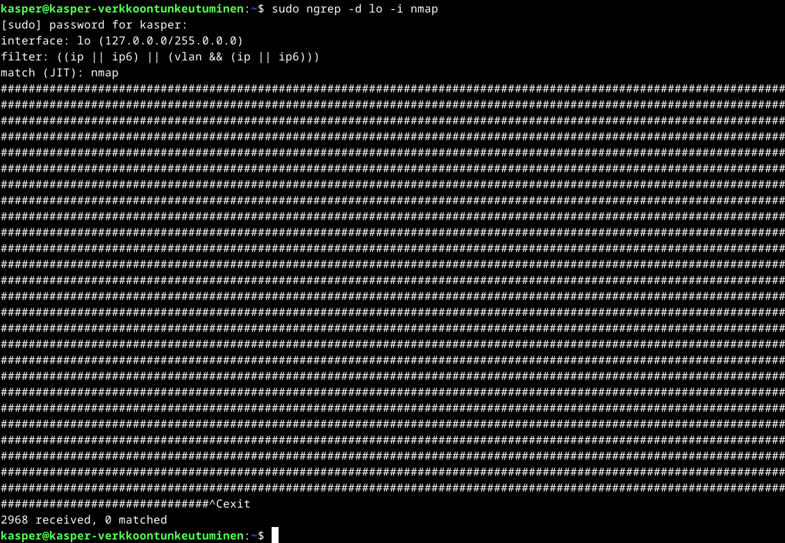
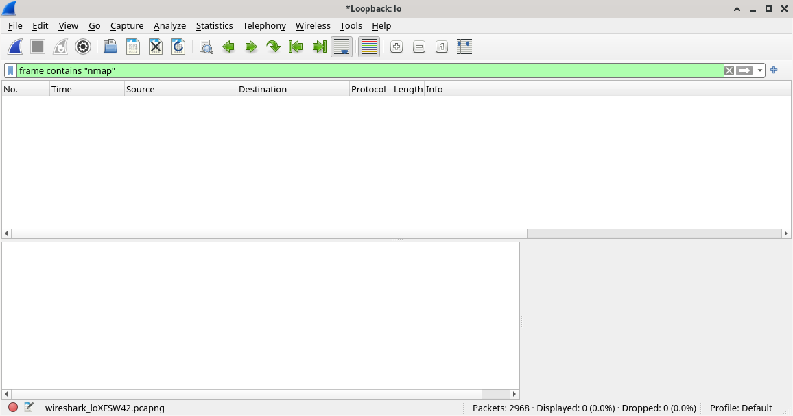
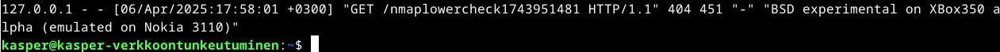

**Tehtävän lopetusaika 6.4.2025 kello 21:15. Aktiivista työskentelyä yhteensä noin 4 tuntia 15 minuuttia.**

## Lähteet
Karvinen T 2025. h2 Tehtävänannot. Tero Karvisen verkkosivut. Luettavissa: https://terokarvinen.com/verkkoon-tunkeutuminen-ja-tiedustelu/ Luettu 6.4.2025

Bianco D 2013. The Pyramid of Pain. Enterprise Detection & Response verkkosivut. Luettavissa: https://detect-respond.blogspot.com/2013/03/the-pyramid-of-pain.html Luettu 6.4.2025

Caltagirone, Pendergast & Betz. The Diamond Model of Intrusion Analysis. Luettavissa: https://www.threatintel.academy/wp-content/uploads/2020/07/diamond-model.pdf Luettu 6.4.2025

Dancuk M 2024. Apache Log Files: How to View, Configure & Use Them. PhoenixNAP verkkosivut. Luettavissa: https://phoenixnap.com/kb/apache-access-log Luettu 6.4.2025

Nurminen 2025. H1 Kybertappoketju. GitHub. Luettavissa: https://github.com/nurminenkasper/Tunkeutumistestaus/blob/main/h1/h1-kybertappoketju.md Luettu 6.4.2025

QuickRef 2025. Grep cheatsheet. Quickref.me. Luettavissa: https://quickref.me/grep.html Luettu 6.4.2025

Wikipedia 2025. WebDAV. Luettavissa: https://en.wikipedia.org/wiki/WebDAV Luettu 6.4.2025

Haiqus 2021. Introduction to ngrep. Coderwall. Luettavissa: https://coderwall.com/p/zqulaw/introduction-to-ngrep Luettu 6.4.2025

Van Der Staak 2023. Evading Detection while using nmap. Luettavissa: https://infosecwriteups.com/evading-detection-while-using-nmap-69633df091f3 Luettu 6.4.2025

Nmap 2025. GitHub. Luettavissa: https://github.com/nmap/nmap/blob/635675b1430a89e950f71112d3bfc74feee4b19a/nselib/http.lua#L2600 Luettu 6.4.2025

