# h3 Aaltoja harjaamassa

## Rauta & HostOS

- Asus X570 ROG Crosshair VIII Dark Hero AM4
- AMD Ryzen 5800X3D
- G.Skill DDR4 2x16gb 3200MHz CL16
- 2x SK hynix Platinum P41 2TB PCIe NVMe Gen4
- Sapphire Radeon RX 7900 XT NITRO+ Vapor-X
- Windows 11 Home 24H2

**Tehtävän aloitusaika 13.4.2025 kello 16:00**

## x) Lue/katso/kuuntele ja tiivistä

### Hubacek 2019: Universal Radio Hacker SDR Tutorial on 433 MHz radio plugs
- Videolla käydään läpi URH sovelluksella signaalin nauhoittamista ja sen analysointia.
- Analyysistä tärkeinpinä oli bitin pituuden vastaaminen aikaan ja error tolerancen käyttö siinä yhteydessä
- Demoluointia näytettiin bitteinä ja hexinä

(Hubmartin 2019)
### Cornelius 2022: Decode 433.92 MHz weather station data
- Artikkelissa käydään läpi rtl_433 ohjelmalla dekoodaamista. 
- Lisäksi käydään läpi Universal Radio Hacker ohjelmalla signaalin nauhoittamista ja sen analysointia
- Projektissa opetettii esimerkiksi tyypillistä demodulaatiota ja digitaalista analyysiä

(Cornelius 2022)
## a) WebSDR
Käytin tehtävän tekemiseen [University of Twente, Enschede - Netherland](http://websdr.ewi.utwente.nl:8901/) Wide-band WebSDR-ohjelmaradiota.

Lähetystä lähdin etsimään käyttämällä Waterfall näkymää ja valitsemalla sieltä kirkkaaksi muuttuvia kohtia. Lisäksi yritin eri vaihtoehtoja AM & FM taajuu modulaation väliltä. Lopulta päädyin kuitenkin AM-modulaation taajuudelle 15594.00kHz, mistä löytyi ilmeisesti joku Lontoosta tuleva lähetys, mutta tarkkaa mainintaa ei vartin kuuntelulla saanut mikä kanava tarkalleen kyseessä. Lähetyksessä puhuttiin sijoittamisesta ja inflaatiosta englanniksi, tämän jälkeen tuli kattava paketti sporttiuutisia.

(Karvinen 2025; WebSDR.org; Amateur radio club ETGD)
## b) rtl_433
Tehtävänanto oli asennella rtl_433 ja kun en Kalia tai Debian SID käyttänyt niin repositorystä ohjelmaa ei suoraan löytynyt. Hain alkuun ohjelman GitHub repositorystä wget komennolla.

Tämän jälkeen paketin purkaminen aunpack komennolla.

GitHubissa oli maininta, että ohjelmaa varten on asenneltava suoraan Debianin paketinhallinnasta muutamat tarpeelliset kirjastot

Seuraavaksi testikäynnistelyt ohjelmalla, mutta sieltä puskikin erroria. libSoapySDR kirjasto jäänyt puuttumaan, joten asennellaan vielä se.

        ./rtl_433
Käynnistelee ohjelman, joten ei muuta kuin homma testiin. 

(Karvinen 2025; Merbanan 2025; Debian 2025)
## c) Automaattinen analyysi
Tehtävässä oli analysoitava Teron toimittamaa [näytettä](https://terokarvinen.com/verkkoon-tunkeutuminen-ja-tiedustelu/samples/Converted_433.92M_2000k.cs8) rtl_433 ohjelmalla. Luonnollisesti ensin oli haettava wget komenonlla Teron sivuilta kyseinen tiedosto.

Seuraavaksi ohjelmalla auki tiedosto suoraan terminaalissa. Ohjelmaa suoritin komennolla `./rtl_433 -r Converted_433.92M_2000k.cs8`. Tästä syötteestä -r toimittaa roolia, että dataa luetaan suoraan syötetystä tiedostosta eikä lähettimestä.

Näytteessä on yhteensä 12 kohtaa, joista kolmessa on yhtenäisyyksiä. Käytännössä kyseessä on tapahtuma, mikä toistetaan neljään kertaan. Analysoidaan kuitenkin hieman tarkemmin:

- **Time**: @0.xxxx - Viittaa aikaan, koska signaali on vastaanotettu
- **Model**: Laitemalli. KlikAanKlikUit-Switch, Proove-Security sekä Nexa-Security.
- **id & House Code**: 8785315, löytyy useampaan kertaan
- **Unit**: Laitteen numero. Löytyy esimerkiksi 0 ja 3
- **Channel**: Käytetty kanava, tässä tapauksessa 3
- **Command**: Lähetetty komento, tässä tapauksessa off
- **Dim & Dim Value**: Himmenykseen liittyvä komento ja himmennykseen liittyvä arvo?
- **Group**: Jonkin sortin ryhmätunnus?

Itse saan tästä kolmen kohdan yhtälöstä semmoisen käsityksen, että KlikAanKlikUit-Switch on jonkin sortin kytkin mitä painetaan ja se lähettää Off-komennon, jonka seurauksena Proove- ja Nexa-turvalaitteet lähettää signaaleja joiden mukaan tila tulisi olla off? Nopealla googlauksella KlikAanKlikUnit, Nexa sekä Proove on kaikki jonkin sortin kotiäly/kytkin yms valmistajia. KlikAanKlikUnit-Switch ainakin lähettää id numeron, joka on lopulta sama kuin Proove-Security ja Nexa-Securityn House Code. Tämä toistuu neljästi, joten kytkintä taidetaan painaa neljä kertaa tallenteessa.

(Karvinen 2025; Merbanan 2025)
## d) Too compex 16?
Seuraavaa tehtävää varten latailin wgetillä Teron URH ohjelmalla nauhoittaman [näytteen](https://terokarvinen.com/verkkoon-tunkeutuminen-ja-tiedustelu/samples/Recorded-HackRF-20250411_183354-433_92MHz-2MSps-2MHz.complex16s) mikä oli tarkoitus saada toimimaan rtl_433 kanssa.

Tiedoston päätehän oli .complex16s ja Teron [vinkeistä](https://terokarvinen.com/verkkoon-tunkeutuminen-ja-tiedustelu/#h3-aaltoja-harjaamassa) löytyi ohjeena, että vain tiedoston nimeä muuttamalla pitäisi homma saada toimimaan. Lähdin siis työstämään `mv` komentoa hyödyntäen. Tiedossa oli myös, että tiedoston nmessä pitää olla oikea taajuus sekä näytteenottotaajuus eroteltuna alaviivalla.

Testiä ajoon eikä lähtenyt millään toimimaan.

Hetken aikaa pähkäilin ja huomasin, että alkuperäinen näytteenottotaajuus on ollut 2MHz eli 2000k, eikä 1000k mitä syötin Teron vinkeistä... Uutta nimeämistä kehiin, missä muutetaan 1000k -> 2000k.

Ja nyt homma rokkaa.

Tehtävänannossa oli tarkoitus analysoida sisältöä, mutta mielestäni näytteen sisältö oli täysin sama mitä tehtävässä c)? Latasin vielä jälkeenpäin tehtävän näytteen uudestaankin ja nimesin, että avasinhan varmasti oikean tiedoston ja kyllä se sisältö samalta näytti. Analysointi löytyy siis ylempää tehtävästä c).

(Karvinen 2025)
## e) Ultimate
Seurailin [Teron ohjeita](https://terokarvinen.com/verkkoon-tunkeutuminen-ja-tiedustelu/#h3-aaltoja-harjaamassa) URH asentamiseen ja aloitin lataamalla tehtävän suorittamiseen liittyvän [näytteen](https://terokarvinen.com/verkkoon-tunkeutuminen-ja-tiedustelu/samples/1-on-on-on-HackRF-20250412_113805-433_912MHz-2MSps-2MHz.complex16s) ja asentamalla pipx

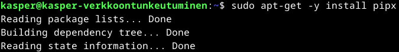

pipx hyödyntäen oli tarkoitus asentaa urh

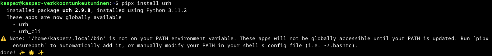

Kuten virheilmoitutksesta jo huomataan, PATH on päivitettävä kohdilleen.

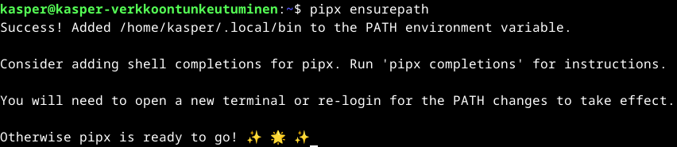

Ei muuta kuin terminaali uudestaan käytiin ja ohjelma käyntiin komennolla `urh`

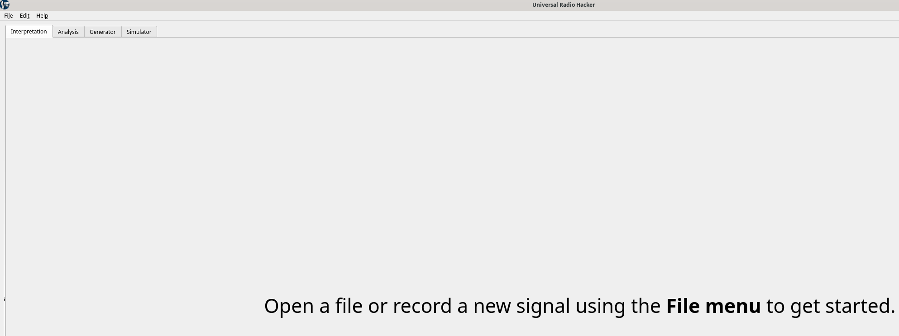

Yläkulmasta **file -> open file** ja valitsemaan sopivaa ladattua kohdetta hakemistosta.

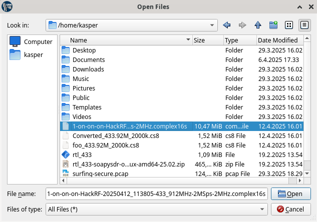

(Karvinen 2025; Jopoh1 2025)
## f) Yleiskuva
Yleiskuvaa lähdin tarkastelemaan ensin valitsemalla koko janan pituuden ja katsomalla kuinka monta bittiä on esimerkiksi valittuna. Pituudeksi näytteelle löydettiin heti 5.49sekunttia.

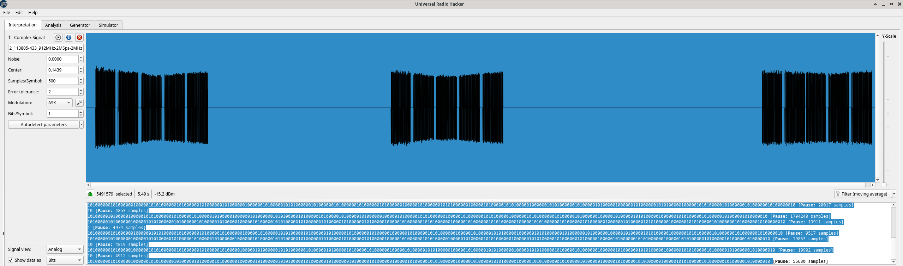

Tämän jälkeen löysinkin yläreunasta **i = info** nappulan, mistä avatusta näkymästä löytyi aika kattava määrä sopivaa dataa yleiskatsausta varten.

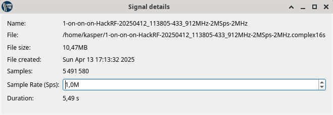

**Koko:** 10.47mb
**Nauhoitus päivämäärä ja kellonaika:** 13.4.2025 17:13:32
**Näytteenottotaajuus:** 1,0M
**Pituus:** 5,49s

(Karvinen 2025)
## g) Bittistä
Lähdin toteuttamaan demulointia niin, että käytin ensin **Autodetect parameters** nappia. Modulaatioksi valikoitui ASK, koska se näytti oikealta silmääni. Lähdin tarkastelemaan, vastaako yksi bitti mikrosekunneissa samaa aikaa kuin Samples/Symbol kohta. Tämä tieto tuli [hubmartin videosta](https://www.youtube.com/watch?v=sbqMqb6FVMY&t=199s)

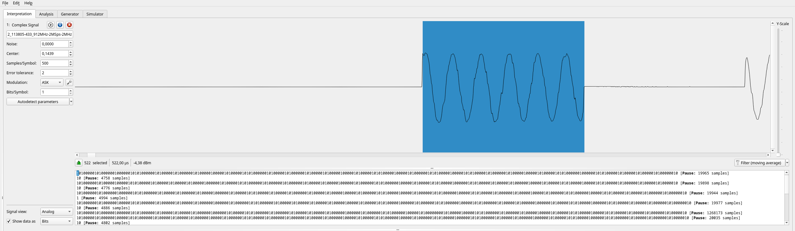

Näyttää oikealta. Tämän jälkeen muutin alareunasta **Signal View** kohdasta **Demodulated** ja tarkistelin vielä liikkuuko yksi bitti kerrallaan 1 ja 0 kohdalla sopivissa sykleissä eli näyttääkö toinen luvuista eri janaa mitä toinen.

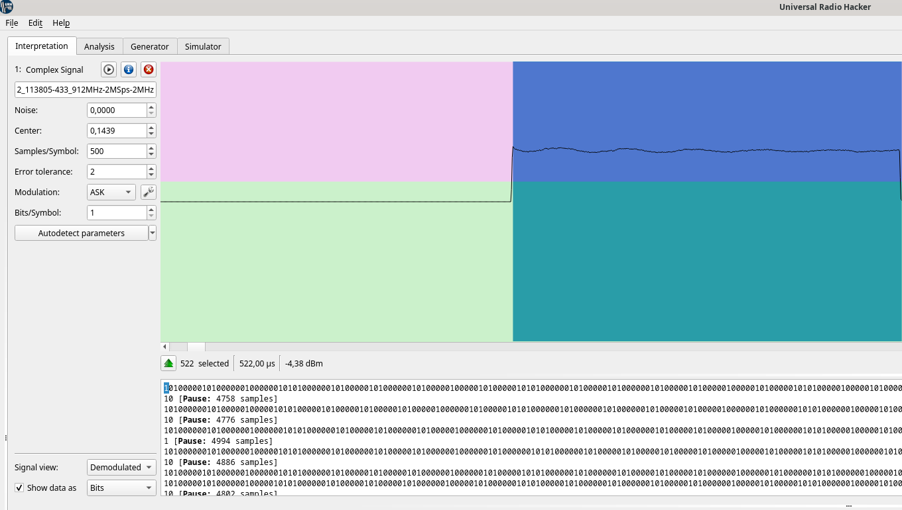
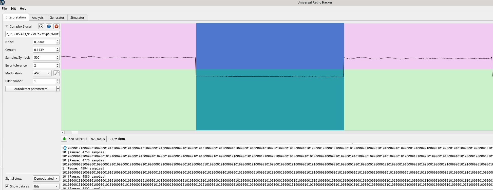

Näytti silmääni osaamisen perusteella oikealta. Tämän jälkeen muutin vielä datan tiedon näytön Hex muotoon ja valitsin yhden riveistä, joka näytti valitsevan yhden toistoalueen. Rivit näytti muutenkin kohtuu samanlaiselta, joten ajattelin tämän riittävän moduloinniksi?

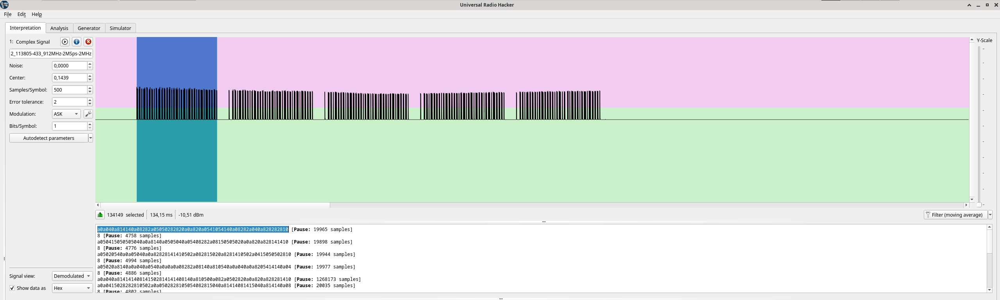

Mielestäni siis oikea modulaatio on **ASK** ja yhden raakabitin aika on **522,00µs**. Ajallista vertausta lähdin hakemaan sillä, että kun valo kulkee 300 metriä mikrosekunnissa niin 522 mikrosekunnissa valo kulkisi noin 156 kilometriä.

**Tehtävän lopetusaika 15.4.2025 kello 20:40. Taukoja ja muiden töiden tekoa runsaasti välissä. Aktiivista työskentelyä yhteensä noin 8 tuntia 30 minuuttia.**

(Karvinen 2025; hubmartin 2019 
## Lähteet
Karvinen T 2025. h3 Aaltoja harjaamassa. Tero Karvisen verkkosivut. Luettavissa: https://terokarvinen.com/verkkoon-tunkeutuminen-ja-tiedustelu/#h3-aaltoja-harjaamassa Luettu 13.4.2025

hubmartin 2019. Universal Radio Hacker SDR Tutorial on 433 MHz radio plugs. Youtube. Katsottavissa: https://www.youtube.com/watch?v=sbqMqb6FVMY&t=199s Katsottu 13.4.2025

Cornelius 2022. Decode 433.92 MHz weather station data. Luettavissa: https://www.onetransistor.eu/2022/01/decode-433mhz-ask-signal.html Luettu 13.4.2025

WebSDR.org. WebSDR Software Radio Listing. Luettavissa: http://websdr.org/ Luettu 13.4.2025

Amateur radio club ETGD. Wide-band WebSDR. Luettavissa: http://websdr.ewi.utwente.nl:8901/ Luettu 13.4.2025

Merbanan 2025. rtl_433 GitHub Repository. Luettavissa: https://github.com/merbanan/rtl_433 Luettu 13.4.2025

Debian 2025. Package: libsoapysdr-dev. Luettavissa: https://packages.debian.org/buster/libsoapysdr-dev Luettu 13.4.2025

Jopohl 2025. urh GitHub Repository. Luettavissa: https://github.com/jopohl/urh?tab=readme-ov-file Luettu 13.4.2025
