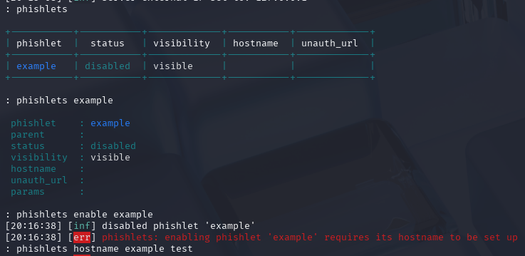

#  h5 Laboratorio- ja simulaatioympäristöt hyökkäyksissä

## Rauta & HostOS

- Asus X570 ROG Crosshair VIII Dark Hero AM4
- AMD Ryzen 5800X3D
- G.Skill DDR4 2x16gb 3200MHz CL16
- 2x SK hynix Platinum P41 2TB PCIe NVMe Gen4
- Sapphire Radeon RX 7900 XT NITRO+ Vapor-X
- Windows 11 Home 24H2

**Tehtävän aloitusaika 5.5.2025 kello 12:00**

## a) Tutustu seuraavaan työkaluun: Evilginx2
Lähdin ratkaisemaan tehtävää ihan puhtaasti googlettamalla, miten saisi asennettua Kalille. Löytyi muutamakin eri tapa, mutta [Kalin omasta repositoriosta](https://www.kali.org/tools/evilginx2/) näytti löytyvän kyseinen paketti. Asentelin sen sieltä suoraan `sudo apt install evilginx2` komennolla.

Ohjelma käyntiin terminaalista `evilginx2` komennolla ja heti käynnistellessä huomasin, että server domain ja server external ip ei ollut asetettuna. Googlailin hetken aikaa ja törmäsin evilginx community [ohjeisiin](https://help.evilginx.com/community), mitä alkuun lähdin noudattamaan. Asetin ohjeiden mukaan domain nimeksi päästä keksityn **hulluduunari.com** ja ipv4 osoitteeksi localhostin eli **127.0.0.1**.

Tähän loppuikin oikeastaan tarjolla ollut ohjeet asennuksesta ja muusta järkevästä mitä löysin, joten lähdin puhtaasti tutustumaan ohjelmaan. Phishletit löytyi help komennolla ja sielä olikin yksi "Example" phislet valmiina mitä lähdin tutkimaan. Vähän neulaa heinäsuovasta lähdin syöttämään komentoja, miten niitä saisi käyttöön ja asetin esimerkiksi alkuun `phishlets enable example` komennolla kyseisen phishletin käyttöön, mutta se vaatikin hostnamen, joten seuraavaksi yritin syöttää sitä `phishlets hostname example test` komennolla.

Vaati tietenkin hostnamen vielä, joten annoin test.hulluduunari.com sille.

No mitä jos nyt käynnistellään phislet enable komennolla?

Yritys hyvä kymmenen, mutta pahalta näyttää. Lähdin tutkimaan ohjelman muita vaihotehtoja ja **lures** kohdasta löytyi vaikka mitä.

Yritin luoda `lures create` komennolla **example** luren ja näytti se ehkä onnistuneenkin?

No joo, sanotaan, että olin TODELLA hukassa tässä vaiheessa ja lähdin perehtymään asiaan ihan muuta kuin omien neuvojen kautta. Löysinkin ihan hyvän suuntaa antavan [videon](https://www.youtube.com/watch?v=z5gLXmXIyH8) miten testata ohjelan toimintaa lokaalisti.

Tässä neuvossa oli tarpeellista ensin asettaa `/etc/hosts` localhostille muutamat osoitteet mitä käytetään.

Tarkastelin lisäksi valmiiksi ohjelmasta löytyvää **Example** Phishletiä, mitä ajattelin tehtävän suorittamisessa käyttää.

Mitään muutoksia en tehnyt, lähinnä halusin nähdä ja yrittää ymmärtää mitä se sisältää. Sisältä löytyi eri Proxy, auth_token, credentials ja login vaihtoehtoja. Okei, no miten niitä käytetään? Lähdin seuraavaksi tällä kertaa avaamaan evilginx2 ohjelmaa lisäsyötteellä `-developer`, mikä helpin mukaan "generates self-signed certificates for all hostnames"

Asetin jälleen config domainin ja ipv4 osoitteen, mutta ne olikin oikeastaan samat mitä aikasemmin. Tällä kertaa kuitenkin annoin **example** phishletille hostnamen **hulluduunari.com** ja laitoin sen `phishlets enable example` komennolla.

Seuraavaksi oli tarpeellista luoda lure, eli url osoite miten liikenteen huijaus tapahtuu. Tämä tapahtui `lures get-url 1` komennolla, mistä sain syötteenä Example phishletissäkin olleen academy osoitetta käytetyn hulluduunari.com osoitteen.

No mitä jos avataan Firefox ja syötetään tuo kyseinen osoite sinne?

Varoitusta puskee, mutta mennään sivustolle sisään joka tapauksessa.

Tässä vaiheessa auki olevaan Evilginx2 ohjelmaan tuli jo ensimmäiset syötteet. Sivustoksi meille aukesi Breakdevin sivusto.

Mitä jos painetaan Login? Olihan meillä Phishletissä credentials tietojakin, kuten aikaisemmin näkyi

Syötin tekstiksi sähköpostin ja salasanan. Perään tietenkin login.

Hei, saatiin sama sähköposti ja salasana syöte myös Evilginx2 puolelle! Videossa mainittiin myös, että `session` komennolla voidaan tarkastella kyseistä toimintaa.

Nähdäänkin käytetty phishlets, käyttäjänimi, salasana, tokeni, ip-osoite ja aika. Pakko myöntää, että ihan en ole varma käytinkö ohjelmaa sillä tavalla kun oli tehtävässä tarkoitus "huijata liikennettä", mutta ihan mielenkiintoinen testailu oli ainakin ja tämähän oli kuitenkin aika tyypillinen Phishing tapahtuman emulointi.

(Kgretzky 2025; Kali.org 2025; Evilginx; Cybertech-Arena 2025)
## b) Sinulla on käytössäsi mininet ympäristö. Luo ympäristö, jossa voit tehdä TCP SYN-Flood hyökkäyksen.
Mininet ympäristön kanssa on tullut taisteltua enemmän tai vähemmän viimeisen viikon aikana. Itsellä meni ehkä tunnilla tai jaetusta ohjeistuksesta jotain ohi, mutta kaikkea maan ja taivaan väliltä on kokeiltu ympäristön käyntiin saamiseksi, mutta ei vain toimi. Opettajalle (Larille) laitoin tästä myös sähköpostia, enkä saanut hommaa skulaamaan riittävän ajoissa tehtävien palautukseen mennessä. 

Käytännössä en saa verkkolaitetta toimimaan / osoitetta mininetille. Kaikki VM Waren asetuksen on käyty ja kokeiltu läpi. Todennäköisesti käyttäjässä on vika ja löydän ratkaisun jostain vertaisarvioinnista, mutta palaan tämän tehtävän pariin vielä myöhemmin, kun saan Mininet ympäristön toimimaan.

**Tehtävän lopetusaika 6.5.2025 kello 21:00. Enemmän tai vähemmän aktiivista työskentelyä yhteensä noin 15 tuntia 00 minuuttia. Tästä ajasta suurin osa Mininetin kanssa taistellessa**

## Lähteet
Haaga-Helia Moodle. Verkkoon tunkeutuminen ja tiedustelu - ICI013AS3A-3001 - 2025p4 - Tero ja Lari. 5. Laboratorio- ja simulaatioympäristöt hyökkäyksissä

Kgretzky 2025. Evilginx GitHub. Luettavissa: https://github.com/kgretzky/evilginx2 Luettu 5.5.2025

Kali.org 2025. Evilginx2. Luettavissa: https://www.kali.org/tools/evilginx2/ Luettu 5.5.2025

Evilginx. Help - Community Intreduction. Luettavissa: https://help.evilginx.com/community Luettu 5.5.2025

Cybertech-Arena 2025. Master Evilginx Phishing Simulation on Localhost(No Domain, No VPS, Free Method!). Katsottavissa: https://www.youtube.com/watch?v=z5gLXmXIyH8 Katsottu 5.5.2025
