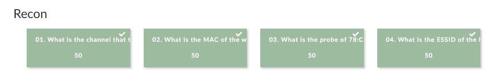
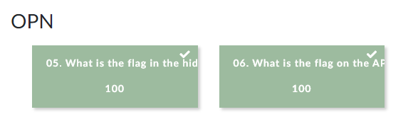
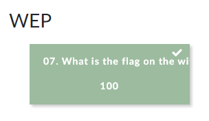
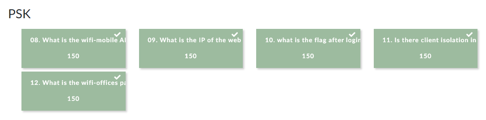
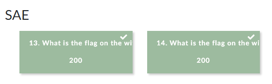
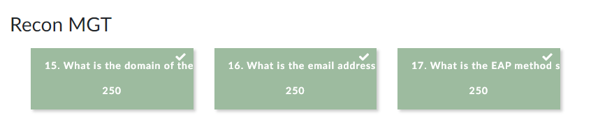

#  h6 WiFi

## Rauta & HostOS

- Asus X570 ROG Crosshair VIII Dark Hero AM4
- AMD Ryzen 5800X3D
- G.Skill DDR4 2x16gb 3200MHz CL16
- 2x SK hynix Platinum P41 2TB PCIe NVMe Gen4
- Sapphire Radeon RX 7900 XT NITRO+ Vapor-X
- Windows 11 Home 24H2

**Tehtävän aloitusaika 9.5.2025 kello 07:00**

## a & b) Tutustu wifi challenge lab 2.1 harjoitus ympäristöön. Kirjoita raportti siitä mitä opit ja mitkä asia yllättivät sinut kun tutustuit harjoitukseen.
Asentelin ja käynnistelin VirtualBox imagella virtuaalikoneen tehtävää varten. Tehtävästä en raportoi varsinaista Walktrough tyyppistä raporttia, koska semmoinen löytyy jo tehtävän [valmistajan](https://r4ulcl.com/posts/walkthrough-wifichallenge-lab-2.0/) toimesta. Keskityn tässä raportissa avaamaan, mitä relevanttia opin jokaisesta eri harjoituksesta.

### Recon
Osiossa opittiin tyypillistä langattomien verkkojen tunnistamista ja tietojen keräämistä. Airmon-ng toimi tyypillisenä työkaluna, millä etsittiin MAC osoitteita, Probeja sekä mdk4 hyödyntäen piilotettuja verkkoja. 

### OPN
Osion tehtävissä opittiin yhdistämään avoimiin Wi-Fi verkkoihin ja ohittamaan kirjautumisportaalit hyödyntäen MAC-osoitteen väärentämistä ja lopulta wiresharkilla verkkoliikennettä tutkimalla näkemään kirjautumistunnukset.

### WEP
Osiossa murtaudutaan vanhaan WEP-salattuun verkkoon, keräämällä dataa ja käyttämällä aircrack-ng murtautumiseen.

### PSK
Osion WPA-PSK verkkojen murtautumista opetellaan kaappaamalla liikenteen välinen kättely ja murtamalla salasana Hashcatilla. Lisäksi tehtävässä käytiin läpi liikenteen salauksen purkamista murtamise jälkeen sekä verkon sisäistä tiedonkeruuta, kuten asiakaslaitteiden tunnistamista ja palveluiden käyttöä.

### SAE WPA3
Tehtävissä hyökättiin WPA3-SAE verkkoihin suoralla brute-force hyökkäyksellä ja hyödyntämällä taaksepäinsopivuutta (WPA2-tilaan) pakottamalla asiakaslaitteita heikompaan, jotta kättely voidaan kaapata.

### Recon MGT
Osiossa kerättiin passiivisesti tietoa yritysverkkojen käyttäjistä, palvelimen sertifikaateista sekä opittiin tunnistamaan tukiaseman tukemat EAP-authetikaatio menetelmät analyysin avulla.

### MGT
Tähän jäätiinkin lopulta valitettavasti jumiin. En saanut ratkaistua ongelmaa Hashcat toiminnan kanssa, edeltävissä tehtävissä toimi kyllä moitteitta, mutta nyt jäi valittelemaan OpenCL toimintaa.

Loppujen lopuksi tuli kuitenkin ratkottua ihan kattavasti tehtäviä. MGT ratkominen jäi toiseen kertaan, kun paremmalla ajalla pystyn selvittelemään mistä OpenCL virhe johtui.

## c) Miten suhtautumisesi WLanin turvallisuuteen muuttui sen jälkeen kun teit harjoitukset?
Itselle oli ehkä mielenkiintoisinta huomata, miten paljon erilaisia haavoittuvuuksia Wi-Fi verkkojen murtautumiseen voidaan käyttää. Päälimmäisenä mieleen jäi se, miten helppoa on kerätä analyysiä verkoista jo ihan muutamalla komennolla airmon-ng avulla. Jatkossa varmasti muistaa, että vahvat salasanat, laitteiden päivitykset ja eri salaustyypit on tärkeässä roolissa Wi-Fi turvallisuudessa.

**Tehtävän lopetusaika 12.5.2025 kello 14:00. Enemmän tai vähemmän aktiivista työskentelyä yhteensä noin 8 tuntia 00 minuuttia.**

## Lähteet
Haaga-Helia Moodle. Verkkoon tunkeutuminen ja tiedustelu - ICI013AS3A-3001 - 2025p4 - Tero ja Lari. 6. WiFi

WiFiChallenge Lab 2025. Luettavissa: https://lab.wifichallenge.com/ Luettu 9.5.2025

r4ulcl. WiFiChallenge Lab Wwalktrough. Luettavissa: https://r4ulcl.com/posts/walkthrough-wifichallenge-lab-2.0/ Luettu 9.5.2025

r4ulcl GitHub. WiFiChallengeLab-docker. https://github.com/r4ulcl/WiFiChallengeLab-docker Luettavissa: 9.5.2025
