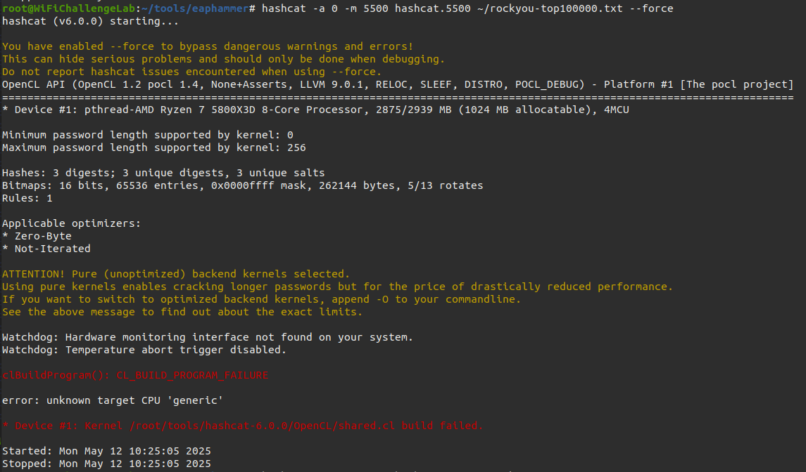
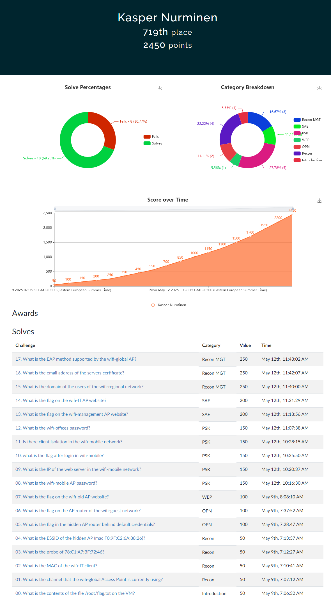
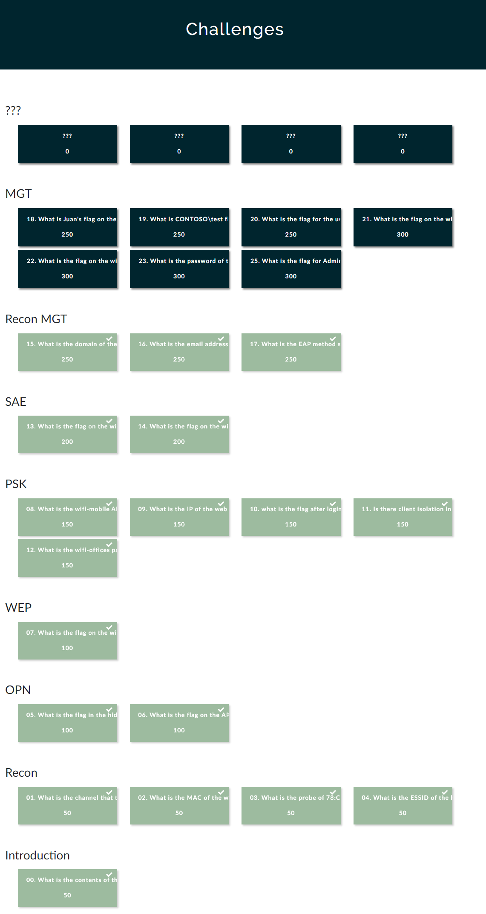

#  h6 WiFi

## Rauta & HostOS

- Asus X570 ROG Crosshair VIII Dark Hero AM4
- AMD Ryzen 5800X3D
- G.Skill DDR4 2x16gb 3200MHz CL16
- 2x SK hynix Platinum P41 2TB PCIe NVMe Gen4
- Sapphire Radeon RX 7900 XT NITRO+ Vapor-X
- Windows 11 Home 24H2

**Tehtävän aloitusaika 9.5.2025 kello 07:00**

## a & b) Tutustu wifi challenge lab 2.1 harjoitus ympäristöön. Kirjoita raportti siitä mitä opit ja mitkä asia yllättivät sinut kun tutustuit harjoitukseen.
Asentelin ja käynnistelin VirtualBox imagella virtuaalikoneen tehtävää varten. Tehtävästä en raportoi varsinaista Walktrough tyyppistä raporttia, koska semmoinen löytyy jo tehtävän [valmistajan](https://r4ulcl.com/posts/walkthrough-wifichallenge-lab-2.0/) toimesta. Keskityn tässä raportissa avaamaan, mitä relevanttia opin jokaisesta eri harjoituksesta.

### Recon
Osiossa opittiin tyypillistä langattomien verkkojen tunnistamista ja tietojen keräämistä. Airmon-ng toimi tyypillisenä työvälineenä, millä etsittiin MAC osoitteita, Probeja sekä mdk4 hyödyntäen piilotettuja verkkoja. 

### OPN

### WEP

### PSK

### SAE WPA3

### Recon MGT

### MGT
Tähän jäätiinkin lopulta valitettavasti jumiin. En saanut ratkaistua ongelmaa Hashcat toiminnan kanssa, edeltävissä tehtävissä toimi kyllä moitteitta, mutta nyt jäi valittelemaan OpenCL toimintaa.

Loppujen lopuksi tuli kuitenkin ratkottua ihan kattavasti tehtäviä. MGT ratkominen jäi toiseen kertaan, kun paremmalla ajalla pystyn selvittelemään mistä OpenCL virhe johtui.

## c) Miten suhtautumisesi WLanin turvallisuuteen muuttui sen jälkeen kun teit harjoitukset?

**Tehtävän lopetusaika 12.5.2025 kello 14:00. Enemmän tai vähemmän aktiivista työskentelyä yhteensä noin XX tuntia 00 minuuttia.**

## Lähteet
Haaga-Helia Moodle. Verkkoon tunkeutuminen ja tiedustelu - ICI013AS3A-3001 - 2025p4 - Tero ja Lari. 6. WiFi

https://r4ulcl.com/posts/walkthrough-wifichallenge-lab-2.0/
